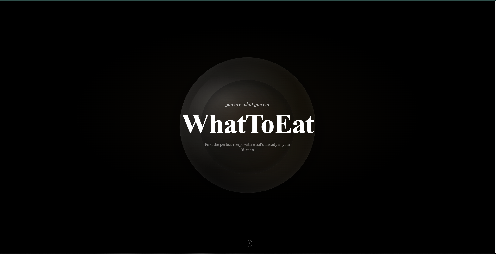
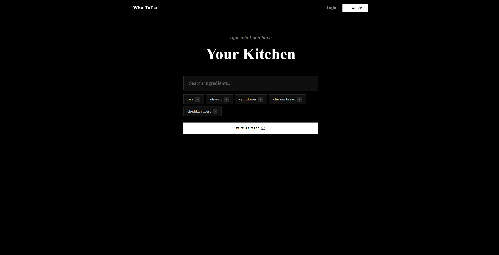
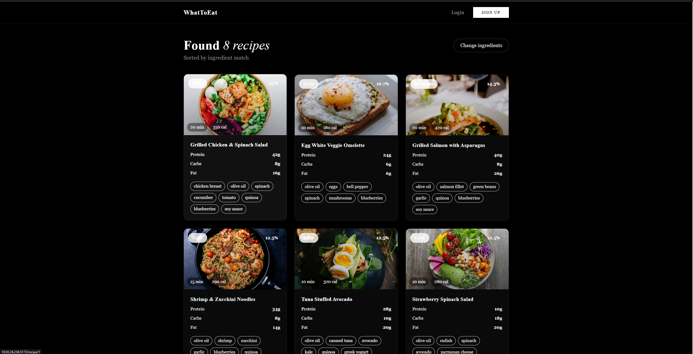

# WhatToEat

Personalized recipe finder based on your nutrition goals, cooking level, and the ingredients you already have at home.

## Demo





## Product Context

**End users:** People who want to cook at home but struggle to decide what to make with what they have.

**Problem:** You open the fridge, see random ingredients, and have no idea what to cook. Searching through recipe sites takes too long and most recipes require things you don't have.

**Solution:** WhatToEat lets you enter the ingredients you have, set your nutrition goal (weight loss, muscle gain, maintenance, healthy eating) and cooking level, then instantly shows you matching recipes sorted by ingredient match percentage.

## Features

### Implemented
- Nutrition goal selection (weight loss, muscle gain, maintenance, healthy eating)
- Cooking level selection (beginner, intermediate, advanced)
- Ingredient search with autocomplete
- Recipe matching by available ingredients with match percentage
- Recipe detail view with instructions, calories, and macros
- Meal logging and calorie tracking (daily/weekly)
- Favorites system
- Auto-generated shopping list for missing ingredients
- User authentication (register/login with JWT)
- Admin panel for user management
- Dark cinematic UI with multi-section landing page
- 70 ingredients across 6 categories, 38 curated recipes

### Not yet implemented
- AI-powered recipe generation
- Meal plan scheduling
- Social features (sharing recipes)
- Mobile app

## Usage

1. Open the app and click **Start Now**
2. Choose your **nutrition goal** (weight loss, muscle gain, etc.)
3. Select your **cooking level** (beginner, intermediate, advanced)
4. **Search and add ingredients** you have available
5. Click **Find Recipes** to get matching results sorted by ingredient match
6. View recipe details with step-by-step instructions and nutrition info
7. Log meals to track your daily calorie intake on the **Dashboard**

## Deployment

### Requirements
- **OS:** Ubuntu 24.04 (or any Linux with Docker support)
- **Docker** and **Docker Compose** installed

### Installation

```bash
# Clone the repository
git clone https://github.com/scaredofthesix/se-toolkit-hackathon.git
cd se-toolkit-hackathon

# Create backend .env file
cp backend/.env.example backend/.env

# Build and start all services
docker compose up -d --build

# Seed the database with ingredients and recipes
docker compose exec backend python -m app.seed
```

### Access
- **Frontend:** http://your-server-ip:5173
- **Backend API:** http://your-server-ip:8000
- **API docs:** http://your-server-ip:8000/docs

### Services
| Service  | Port | Description          |
|----------|------|----------------------|
| frontend | 5173 | React app (Vite)     |
| backend  | 8000 | FastAPI server       |
| db       | 5432 | PostgreSQL 16        |

## Tech Stack

- **Backend:** Python 3.12, FastAPI, SQLAlchemy, JWT authentication
- **Frontend:** React 18, Vite, Tailwind CSS
- **Database:** PostgreSQL 16
- **Deployment:** Docker, Docker Compose

## License

[MIT](LICENSE)
